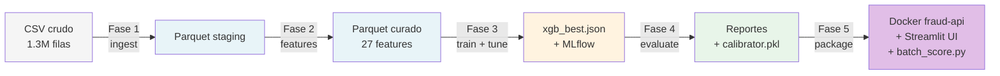
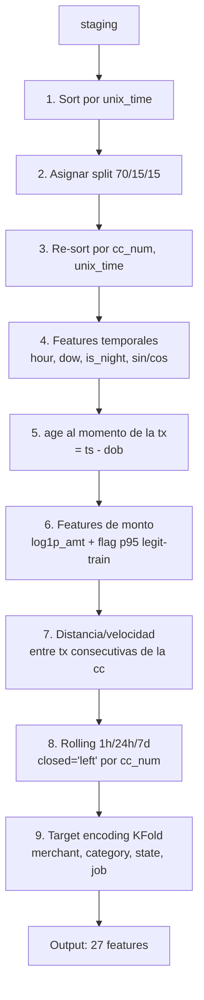
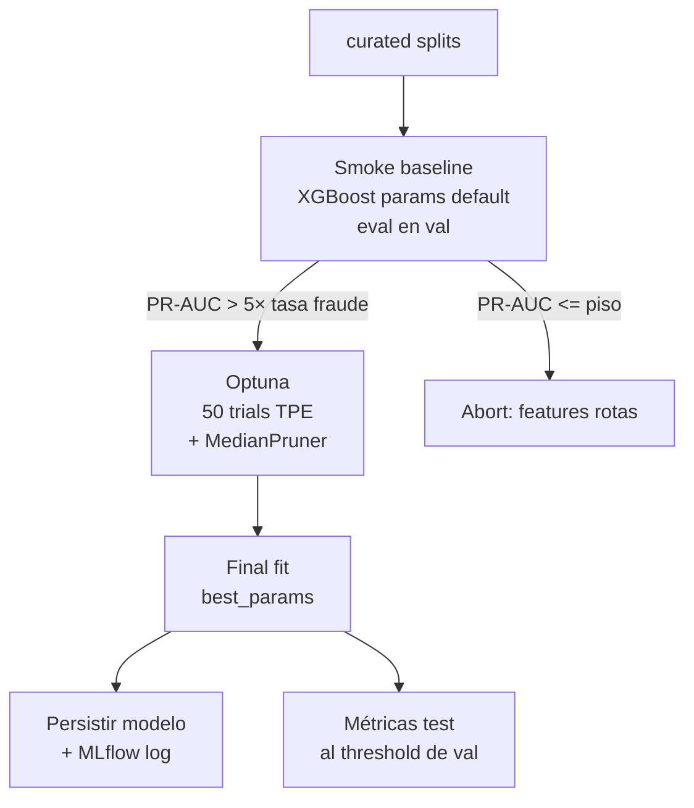
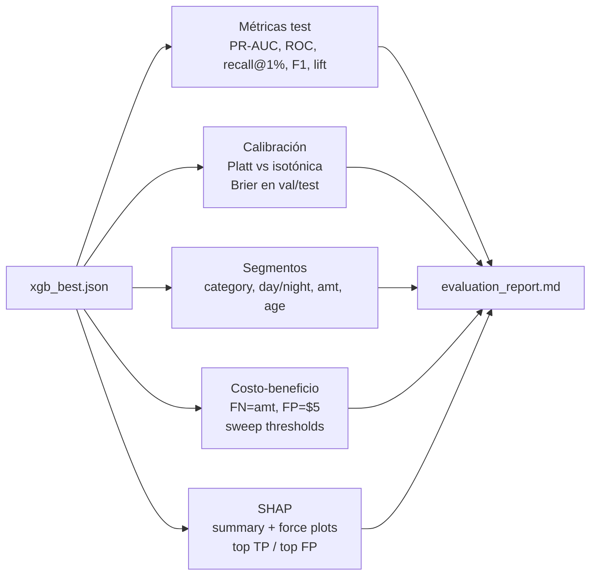

# Metodología — pipeline end-to-end

Documento orientado a explicar **cómo se construyó el modelo** paso a paso. Pensado para slides de "metodología" en una presentación.

## Vista de alto nivel



Cada fase es **idempotente** y trackeable con `make <fase>`. El único input externo es el CSV de Kaggle.

---

## Fase 1 — Ingesta

**Input**: `data/raw/fraudTrain.csv` + `data/raw/fraudTest.csv` (Kaggle).
**Output**: `data/staging/transactions.parquet` (24 columnas, 1.296.675 filas).
**Código**: [`src/ingest.py`](../src/ingest.py).

**Qué hace**:
1. Concatena Train + Test (los re-particionamos cronológicamente luego, no se usan los splits originales).
2. Parsea `trans_date_trans_time` a datetime.
3. Convierte a parquet con compresión `zstd` para acelerar las fases siguientes (CSV → parquet baja el tiempo de lectura ~10×).

**Decisión clave**: no se modifican datos en esta fase. Solo cambio de formato.

---

## Fase 2 — Feature engineering

**Input**: `data/staging/transactions.parquet`.
**Output**: `data/curated/transactions_features.parquet` (29 columnas: 27 features + `is_fraud` + `split`).
**Código**: [`src/features.py`](../src/features.py).

### Pipeline interno (en orden estricto)



### Categorías de features

| categoría | features | señal que captura |
|---|---|---|
| **monto** | `log1p_amt`, `amt_gt_p95_legit` | "esta tx es atípicamente grande" |
| **temporal** | `hour`, `dow`, `is_night`, `hour_sin`, `hour_cos` | "fraude se concentra en horario nocturno" |
| **demografía** | `age` | edad del titular al momento de la tx |
| **geografía** | `time_since_last_tx`, `dist_consecutive_km`, `velocity_kmh` | "viaje imposible" entre tx consecutivas |
| **histórico** | `rolling_count_*`, `rolling_amt_sum_*`, `rolling_amt_mean_*`, `rolling_amt_std_*` (× 1h/24h/7d) | "la cc está fuera de su patrón habitual" |
| **categórico** | `te_merchant`, `te_category`, `te_state`, `te_job` | tasa histórica de fraude por categoría (target encoding) |

### Garantías anti-leakage

- `closed='left'` en rolling → la tx actual no está en su propio agregado.
- p95 calculado solo sobre legítimas-train.
- Target encoding KFold (out-of-fold dentro de train) + mapping fitteado solo en train para val/test.
- `cc_num` se usa solo como llave de agregación, **nunca** como feature.
- Tests en [`tests/test_features.py`](../tests/test_features.py) verifican estas propiedades.

---

## Fase 3 — Entrenamiento + tuning

**Input**: `data/curated/transactions_features.parquet`.
**Output**: `models/xgb_best.json` + `mlruns/` + `reports/feature_importance.csv` + figuras.
**Código**: [`src/train.py`](../src/train.py).

### Pipeline interno



### Hiperparámetros buscados (rangos Optuna)

| param | rango | óptimo encontrado |
|---|---|---:|
| `max_depth` | int [4, 10] | **10** |
| `learning_rate` | log-uniform [0.01, 0.3] | **0.193** |
| `min_child_weight` | log-uniform [1, 100] | **89.8** |
| `subsample` | uniform [0.6, 1.0] | **0.97** |
| `colsample_bytree` | uniform [0.6, 1.0] | **0.71** |
| `gamma` | uniform [0, 5] | **4.78** |
| `reg_alpha` | uniform [0, 10] | **0.57** |
| `reg_lambda` | uniform [0, 10] | **0.044** |

### Setup de XGBoost

- `device='cuda'` + `tree_method='hist'` → entrenamiento en GPU (RTX 4060, 8GB VRAM).
- `objective='binary:logistic'`, `eval_metric='aucpr'`.
- `scale_pos_weight=176` → compensa el desbalance sin sintetizar datos (ver [ADR-03](architecture_decisions.md#adr-03--scale_pos_weight176-en-lugar-de-smote)).
- Early stopping: 30 rondas sobre `aucpr` en val.

### MLflow tracking

Experiment `fraud_xgboost`:
- Run `baseline` — params default, métricas val.
- Run `best` — params Optuna, métricas val + test, modelo persistido como artefacto.
- Run `evaluation` — Fase 4 (calibración + segmentos + costo + SHAP).

---

## Fase 4 — Evaluación profunda

**Input**: `models/xgb_best.json` + curated splits.
**Output**: `reports/evaluation_report.md` + `models/calibrator.pkl` + figuras.
**Código**: [`src/evaluate.py`](../src/evaluate.py).

### Bloques



### Restricciones operativas

- **No re-tunear** hiperparámetros — el modelo es el de Fase 3, fijo.
- **No recalcular** el threshold operativo en test — se usa el de val (0.6642).
- Calibración fitteada en val, evaluada en test (no contaminar test).
- SHAP sobre sample de 5,000 filas (RAM-friendly).

---

## Stack técnico

| componente | versión | rol |
|---|---|---|
| Python | 3.10 | runtime |
| XGBoost | 2.1.4 | modelo principal (CUDA) |
| Optuna | 4.8 | hyperparameter tuning |
| MLflow | 2.22 | experiment tracking |
| SHAP | 0.49 | interpretabilidad |
| scikit-learn | 1.7 | métricas + calibración |
| pandas / numpy | 2.x / 1.26 | data manipulation |
| pyarrow | latest | parquet I/O |
| matplotlib | latest | visualización |

**Hardware**: NVIDIA RTX 4060 (8GB VRAM), entrenamiento full pipeline en ~10 minutos.

---

## Reproducibilidad

```bash
make ingest     # ~30s
make features   # ~2min
make train      # ~10min (50 trials Optuna)
make evaluate   # ~30s
make test       # ~5s
```

Todas las fases:
- Fijan `random_state=42` (XGBoost, Optuna, KFold).
- Persisten outputs intermedios → re-ejecuciones parciales son baratas.
- Loggean a MLflow → comparables entre runs.

## Tests

14 tests passing — distribuidos en cada fase:

- `test_bootstrap.py` — entorno OK (xgboost CUDA, parquet I/O).
- `test_features.py` — anti-leakage en rolling, target encoding, p95.
- `test_train.py` — splits disjuntos, no target en X, baseline supera piso.
- `test_evaluate.py` — round-trip de modelo, calibración mejora Brier, aditividad SHAP.

---

## Fase 5 — Packaging + servicios

**Outputs**:
- Imagen Docker `fraud-api` (~1 GB, CPU-only) con FastAPI + modelo + calibrador embebidos.
- Streamlit UI local en [`fraud_ui/`](../fraud_ui/) con dropdown de tx, score y SHAP top-5.
- CLI [`scripts/batch_score.py`](../scripts/batch_score.py) que reproduce PR-AUC = 0.8771 sobre el test set entero vía API (sanity end-to-end).

**Decisiones clave**:
- API en container, UI local, UI lee parquet directo. Ver [ADR-14](architecture_decisions.md#adr-14--api-containerizada--ui-streamlit-local--ui-lee-parquet-directo).
- Modelo, calibrador y `TreeExplainer` se cargan **una sola vez** en el lifespan startup. `/score` responde en ~20 ms en CPU local (la mayor parte es SHAP).
- Las features `rolling_*` y `te_*` admiten `null` JSON: XGBoost las trata como missing-value; sin esto el ~98 % del test set sería inutilizable.
- Decisiones a thresholds 0.6642 (F1*) y 0.52 (mín costo) se aplican al **score crudo** — el calibrado se reporta como probabilidad pero no decide.

**Tests**: 11 tests con `FastAPI TestClient` (`fraud_api/tests/test_api.py`) + 2 tests con monkeypatch para `batch_score` (`tests/test_batch_score.py`). 27 tests totales en el repo, todos pasando.

```bash
make api-docker-build         # construye fraud-api
make api-docker-run           # levanta el container
make ui                       # streamlit en otra terminal
make batch-score              # PR-AUC = 0.8771 ✓
```
