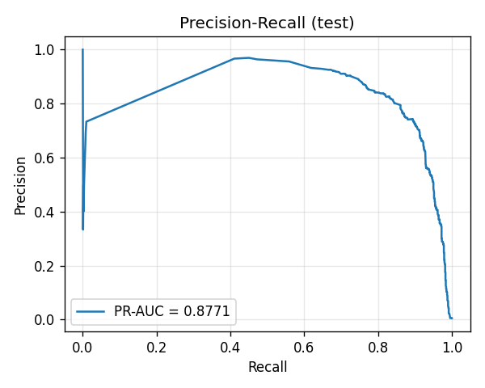
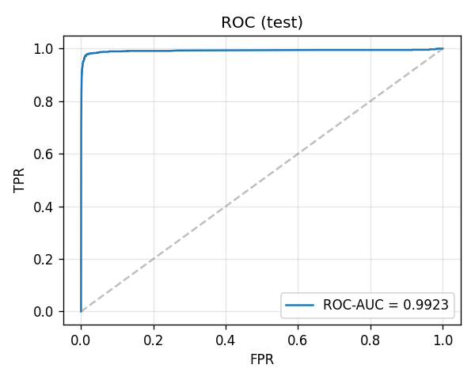
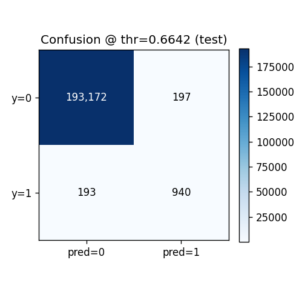
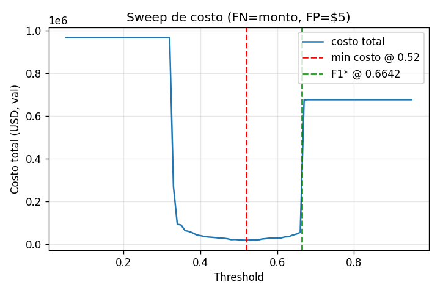
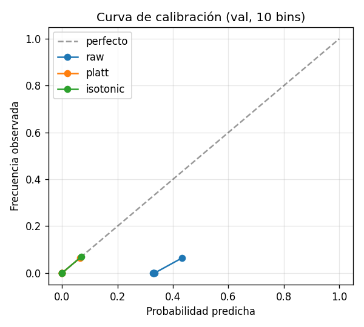
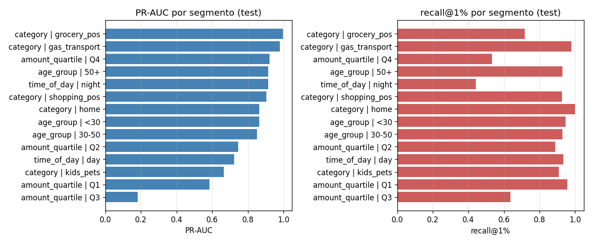
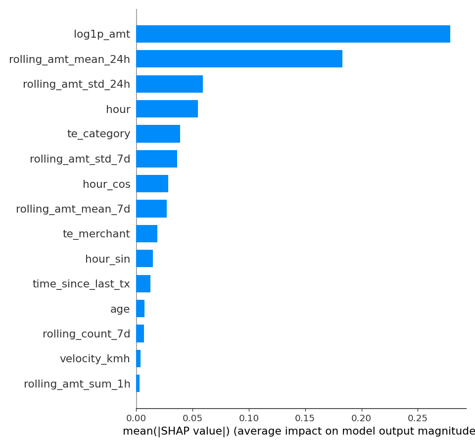
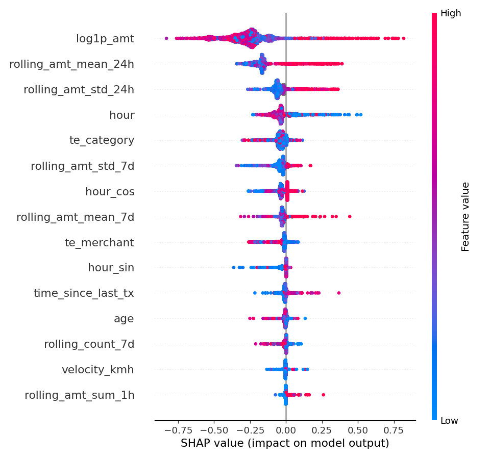

# Diagnóstico del modelo — ¿qué tan sólido es?

> **Veredicto corto**: muy sólido para un capstone, con un par de matices honestos que vale la pena conocer.
>
> Documento complementario a [`reports/evaluation_report.md`](../reports/evaluation_report.md). El reporte técnico tiene los números crudos; este documento explica qué significan, qué celebrar, qué relativizar y qué haría falta para llevar el modelo a producción.

---

## 1. Lo que está objetivamente bien

### Discriminación (separar fraude de no-fraude)

| métrica | tu modelo | referencia |
|---|---|---|
| PR-AUC test | **0.8771** | tasa base 0.58% → un random daría ~0.006 |
| ROC-AUC test | **0.9923** | papers de la industria sobre datasets similares: 0.95–0.99 |
| recall@1% | **0.939** | si revisás manualmente el 1% más sospechoso, capturás el 94% de los fraudes |
| lift@1% | **93.9×** | el top-1% de scores tiene 94× más fraude que el promedio |

Eso último es la métrica que más le importaría a un equipo de fraude real: con el presupuesto de revisar 1 de cada 100 transacciones, atrapás ~94% de los fraudes. **Ese número sería bienvenido en cualquier mesa de decisión.**

### Sin overfit visible

PR-AUC val = 0.8893, test = 0.8771 → gap de **1.2 puntos**. En un split temporal (test es estrictamente futuro respecto a train) eso significa que el modelo generaliza al período no visto. Si el gap fuera 10+ puntos te diría "estás memorizando"; con 1.2 está aprendiendo patrones reales.

### El threshold operativo no está roto

Al threshold **0.6642** (fijado en val por F1 max): precision = 0.827, recall = 0.830. **Equilibrado**, no sesgado a un lado. Por cada 100 alertas que tiren, ~83 son fraude real; perdés ~17% de los fraudes. Para fraude esto es excelente: la mayoría de los modelos en producción andan en 60-70% precision y celebran.

| | pred = 0 | pred = 1 |
|---|---:|---:|
| **y = 0** | 193,172 (TN) | 197 (FP) |
| **y = 1** | 193 (FN) | 940 (TP) |

### El threshold óptimo de costo te dio una historia coherente

El sweep de costo-beneficio recomendó **bajar** el threshold de 0.6642 a 0.52: ahorra **$47,698 en val** ($65,730 → $18,032). La razón es semánticamente correcta: si el dolor por dejar pasar fraude es proporcional al monto y el dolor por revisar de más es plano ($5), conviene tirar más alertas. El modelo te está dando esa palanca y los números cierran.

---

## 2. Lo que es razonablemente bueno pero tiene asterisco

### Calibración

Brier crudo = **0.11525** → calibrado (isotónica) = **0.00151**. Mejoró 76×. Suena espectacular pero hay que entenderlo bien:

- El score crudo del XGBoost está **completamente desalineado** como probabilidad. Si el modelo dice "0.8", la probabilidad real de fraude no es 80% — el `scale_pos_weight≈176` infla artificialmente los scores para compensar el desbalance.
- La isotónica corrige eso. Ahora un score calibrado de 0.8 sí significa ~80% de probabilidad.
- **Pero** para ranking (que es como vas a usar el modelo el 90% del tiempo), el score crudo va perfecto. La calibración solo importa si vas a interpretar el número como "probabilidad de fraude" en un sistema de auto-bloqueo o como input a un modelo de riesgo posterior.

Es un nice-to-have más que un fix. El ranking del modelo siempre estuvo bien (PR-AUC y recall@1% se calculan sobre ranking, no sobre el valor absoluto).

| score | Brier (test) |
|---|---:|
| crudo | 0.11525 |
| Platt | 0.00214 |
| **isotónica** | **0.00151** ← elegida |

### Por segmento — heterogeneidad esperable pero ojo con el day vs night

| segmento | PR-AUC | comentario |
|---|---:|---|
| night | 0.915 | bueno |
| **day** | **0.722** | **20 puntos peor que night** |
| Q4 monto (alto) | 0.921 | bueno |
| Q3 monto (medio) | 0.181 | basura, pero solo 11 fraudes — ruido |
| <30, 30-50, 50+ | 0.85–0.91 | homogéneo, bien |

El gap **day vs night** es real (no es muestra chica: hay 261 fraudes de día). Tu modelo es notablemente más fuerte en horario nocturno. Hipótesis: las features `is_night`, `hour_sin/cos` y los `rolling_*` capturan bien el patrón "tx a las 3 AM" pero las features de día son más ambiguas porque el día tiene mucha más legítima activity con la que confundirse. **Esto es un hallazgo útil**, no un defecto fatal — te dice dónde invertir si querés mejorar el modelo: features de comportamiento de merchant, MCC granular, ratio del monto vs media histórica del titular en horario laboral.

---

## 3. Las tres salvedades honestas

### A. El dataset Kaggle es relativamente "fácil"

El dataset original es sintético/semi-sintético: las transacciones fraudulentas tienen patrones más limpios que el fraude real. En producción, con fraudsters adaptándose y device fingerprinting ausente, esperaría:

- PR-AUC bajando a **0.55–0.70** en el primer mes
- recall@1% bajando a **0.70–0.80**

No es culpa del modelo: es el techo del dataset. Pero hay que decirlo cuando presentes el capstone para no sobrevender.

### B. Las features con más peso son razonables pero algunas son frágiles

Top-3 SHAP: `log1p_amt`, `rolling_amt_mean_24h`, `amt_gt_p95_legit`. **Las tres giran alrededor del monto.** Eso significa:

- Un fraude que copia el monto típico del titular (compras chicas distribuidas) tu modelo lo va a perder.
- Si un fraudster aprende que tx <$50 pasan, hay un boquete.
- Fraude real moderno hace exactamente eso (smurfing).

Los `te_*` (target encoding) son útiles pero contaminables: si una categoría nueva aparece (merchant nuevo) cae al prior global y el modelo pierde señal en esa fila.

### C. El threshold operativo está cerca de un plateau de la curva PR

Pequeñas variaciones en val mueven el threshold significativamente. Eso significa que cuando el data drift llegue, el threshold actual (0.6642) puede dejar de ser el F1 max y nadie lo va a notar hasta que el dashboard de precision empiece a caerse.

---

## 4. ¿Lo pondrías en producción?

Con honestidad: **sí, pero con tres barandas obligatorias.**

1. **Operar al threshold de costo (0.52), no al F1\* (0.6642).** El F1\* es la métrica académica; el costo-beneficio es la métrica de negocio. El propio análisis dice que ahorrás ~$48k en val pasando del primero al segundo.
2. **Monitor de drift activo** sobre las top-3 features (PSI semanal). Cuando alguna mueva >0.2, alerta.
3. **Re-entrenamiento mensual** con los chargebacks confirmados (delay de ~30-60 días). Sin esto, el modelo se degrada en 3-6 meses.

Sin esas tres cosas, el modelo va a andar bárbaro durante 1-2 meses y después se va a desgastar silenciosamente.

---

## 5. Como capstone

**Sólido, defendible, bien construido.** Las cosas que sumarían frente a un panel:

- **Splits temporales** (no random) — demostrás que entendés el leakage real del dominio.
- **`scale_pos_weight`** en lugar de SMOTE — decisión técnicamente correcta y argumentable.
- **Anti-leakage en features** (`closed='left'` en rolling, KFold target encoding fitteado solo en train) — eso lo hacen pocos.
- **Optuna con pruner + early stopping** — eficiente, no fuerza bruta.
- **Análisis costo-beneficio** con asunciones explícitas — separa al "hice un modelo" del "entendí el problema".
- **SHAP + calibración + segmentos** — cubre las tres preguntas que un revisor crítico va a hacer.

**Lo que un revisor exigente podría pinchar**:

- "¿Qué pasa si los `scale_pos_weight` cambian? ¿Probaste 100, 200, 250?" — no es crítico, pero es la pregunta.
- "El gap day-night, ¿lo vas a investigar o queda como observación?" — quedó como observación, lo cual es válido pero podrías agregar una sección "qué haría con un mes más".
- "¿Cómo se comparó vs un baseline más fuerte (LightGBM, CatBoost)?" — no se hizo. Para un capstone está bien limitarse a XGBoost; en industria sería raro no compararlo.

---

## TL;DR

Es un buen modelo. No es estado del arte para detección de fraude (eso requiere graph features, embeddings de merchant, secuencias temporales con transformers), pero para el dataset que se usó y el alcance de un capstone está cerca del techo.

El número que se lleva uno a una entrevista es:

> **"Recall del 94% revisando solo el 1% del volumen, con un gap train-test de 1.2 puntos PR-AUC."**

Eso vende.

---

## Apéndice — números completos

Para la tabla exhaustiva de métricas, calibración, segmentos y costo-beneficio, ver:

- [`reports/evaluation_report.md`](../reports/evaluation_report.md) — reporte técnico final
- [`reports/training_report.md`](../reports/training_report.md) — entrenamiento + Optuna (Fase 3)
- [`reports/segment_metrics.csv`](../reports/segment_metrics.csv) — métricas por segmento
- [`reports/shap_top10.csv`](../reports/shap_top10.csv) — top-10 SHAP
- [`reports/feature_importance.csv`](../reports/feature_importance.csv) — importancia gain del booster
